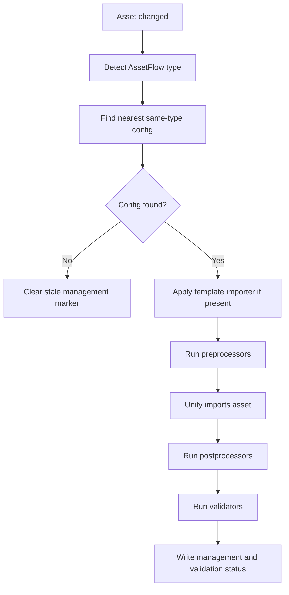

# AssetFlow 产品设计报告

<div style="border:1px solid #d0d7de;border-radius:8px;padding:16px;margin:12px 0;background:#f6f8fa;">
  <strong>产品定位</strong>
  <p style="margin:8px 0 0;">
    AssetFlow 是一个 Unity 编辑器资源导入治理工具。它允许团队在任意资源文件夹内放置类型化配置文件，
    将该文件夹范围内的同类型资源交由配置统一管理，包括导入参数、预处理器、后处理器和校验器。
  </p>
</div>

## Problem Statement

Unity 的资源导入设置默认分散在每个资源自己的 importer 与 `.meta` 文件中。随着项目规模增长，同一目录下的同类资源经常需要保持一致的导入规则，例如 UI 纹理、角色模型、音频、文本配置、Addressables 相关资产等。

当前痛点包括：

1. 单个资源的 importer 设置容易被手动改乱，团队难以确认资源是否符合目录规范。
2. 同一文件夹下新增资源时，需要人工记得套用相同导入规则。
3. 配置变更后，很难可靠地重新处理所有受影响资源。
4. 预处理、后处理、校验逻辑通常散落在全局 `AssetPostprocessor` 中，难以做到“只对某个文件夹生效”。
5. 当父子文件夹存在不同规范时，缺少直观、可解释的管辖关系。
6. 资源 inspector 中无法明确看到某个资源是否被目录策略接管，以及被哪个配置文件接管。

AssetFlow 要解决的是：让资源导入规范从“每个资源各自维护”转变为“文件夹配置统一托管”，同时保持 Unity 原生导入管线的稳定性和可追踪性。

## Solution

AssetFlow 使用“类型化文件夹配置 + 全局导入分发器”的方案。

每个 AssetFlow 配置只管理一种资源类型，配置文件放在目标文件夹内，命名格式为：

```text
.assetflow.{type}.asset
```

示例：

```text
Assets/UI/.assetflow.Texture.asset
Assets/Characters/.assetflow.Model.asset
Assets/Audio/.assetflow.Audio.asset
Assets/Data/.assetflow.Text.asset
```

配置的管辖范围默认为其所在文件夹。若启用“包含子文件夹”，则递归管理子文件夹内的同类型资源，但当子文件夹内存在同类型 AssetFlow 配置时，子配置会覆盖父配置。

<div style="border:1px solid #0969da;border-radius:8px;padding:14px;margin:16px 0;background:#ddf4ff;">
  <strong>核心原则</strong>
  <ul style="margin:8px 0 0 20px;">
    <li>AssetFlow 不替换 Unity 原生 importer。</li>
    <li>AssetFlow 将资源 importer 设置同步到配置中定义的版本。</li>
    <li>AssetFlow 负责按文件夹和类型分发预处理器、后处理器和校验器。</li>
    <li>资源 inspector 必须明确显示接管状态和接管配置。</li>
    <li>配置新增、删除和移动必须重新处理受影响资源；配置内容编辑先标记为待应用，由用户显式 Apply。</li>
  </ul>
</div>

## Glossary

| 术语 | 含义 |
|---|---|
| AssetFlow 配置 | 放置在文件夹中的 `.assetflow.{type}.asset` 配置资源 |
| AssetFlow 类型 | AssetFlow 内部定义的资源类型，例如 Texture、Model、Audio、Text、Prefab |
| 被接管资源 | 被某个 AssetFlow 配置命中的资源 |
| Template Importer | 配置中用于描述 Unity importer 设置的模板或规则 |
| 预处理器 | 导入前执行的类型化处理逻辑 |
| 后处理器 | 导入后执行的类型化处理逻辑 |
| 校验器 | 对导入结果或资源状态进行检查并输出诊断的逻辑 |
| 管辖范围 | 配置所在文件夹，以及可选的递归子文件夹范围 |
| 同类型覆盖 | 子文件夹中的同类型配置优先于父文件夹配置 |

## Product Rules

### 1. 类型化配置

一个 AssetFlow 配置只能对应一种 AssetFlow 类型。

```text
Assets/UI/.assetflow.Texture.asset
```

该配置只接管 UI 文件夹下命中的纹理资源，不影响音频、模型、Prefab 或其他类型资源。

### 2. 多类型共存

同一个文件夹下可以存在多个不同类型的 AssetFlow 配置。

```text
Assets/Characters/.assetflow.Model.asset
Assets/Characters/.assetflow.Texture.asset
Assets/Characters/.assetflow.Audio.asset
```

每个配置独立解析、独立生效、独立触发重处理。

### 3. 同类型唯一

同一个文件夹下只能存在一个同类型 AssetFlow 配置。

如果出现多个同类型配置，系统必须报错，并只允许一个配置进入有效状态。建议在 inspector 和 AssetFlow 管理窗口中同时显示冲突。

### 4. 最近配置优先

当父文件夹和子文件夹都存在同类型配置时，子文件夹配置优先。

```text
Assets/
  .assetflow.Texture.asset
  UI/
    icon.png
    Buttons/
      .assetflow.Texture.asset
      play.png
```

在上例中：

| 资源 | 生效配置 |
|---|---|
| `Assets/UI/icon.png` | `Assets/.assetflow.Texture.asset` |
| `Assets/UI/Buttons/play.png` | `Assets/UI/Buttons/.assetflow.Texture.asset` |

### 5. 可递归管辖

配置默认只管辖所在文件夹。启用“包含子文件夹”后，递归管理子文件夹。

若父配置启用了递归，但子文件夹中存在同类型配置，则子配置会截断父配置的管辖范围。

### 6. Importer 可选

配置可以不提供 Template Importer。

这允许“没有 AssetFlow importer 设置”的类型仍然使用预处理器、后处理器和校验器。例如：

1. 文本配置资源只需要命名规范校验。
2. Prefab 只需要组件结构校验。
3. 材质只需要 Shader 与关键字校验。
4. 自定义资产只需要后处理索引和诊断报告。

### 7. 处理器和校验器类型匹配

配置中可选择的预处理器、后处理器和校验器必须声明支持的 AssetFlow 类型。

例如 Texture 配置只能选择 Texture 类型处理器和通用处理器，不能选择 Model 专用处理器。

### 8. 接管状态可见

所有被接管资源的 importer inspector 中必须显示：

1. 当前资源已被 AssetFlow 接管。
2. 接管配置文件路径。
3. 配置类型。
4. 配置版本或规则 hash。
5. 最近一次应用结果。
6. 最近一次校验结果入口。

示例显示：

```text
AssetFlow Managed
Type: Texture
Config: Assets/UI/.assetflow.Texture.asset
Rule Hash: 9F4A...
Last Applied: 2026-05-11 20:40
Validation: 0 Errors, 1 Warning
```

### 9. 配置生命周期触发重处理

配置发生新增、删除或移动时，系统必须重新计算受影响资源，并重新处理相关文件。配置内容被用户编辑时，系统只重新计算管理关系和 stale 状态，不自动批量重处理旧资源；用户通过显式 Apply 把编辑后的规则应用到受管资源，避免 Inspector 编辑过程触发昂贵的导入风暴。

受影响资源包括：

1. 新配置开始管辖的资源。
2. 被删除配置曾经管辖的资源。
3. 因配置移动而进入或离开管辖范围的资源。
4. 因 `includeSubfolders` 修改而新增或移除管辖关系的资源。
5. 因子配置新增而从父配置脱离的资源。
6. 因子配置删除而回落到父配置的资源。
7. 因 Template Importer、预处理器、后处理器或校验器版本变化而需要重新应用规则的资源，这类资源应显示 stale，等待用户 Apply。

## User Stories

1. As a technical artist, I want to place a Texture AssetFlow config in a UI folder, so that all UI textures in that folder use the same import settings.
2. As a technical artist, I want a Model AssetFlow config to manage character models, so that model scale, material import and animation settings remain consistent.
3. As an audio designer, I want an Audio AssetFlow config in an audio folder, so that new audio files automatically receive the correct compression and load type settings.
4. As a tools programmer, I want each AssetFlow config to target one type only, so that rules are predictable and easy to reason about.
5. As a tools programmer, I want one folder to contain multiple different type configs, so that a content folder can manage textures, models and audio independently.
6. As a tools programmer, I want the editor to block duplicate same-type configs in one folder, so that two configs cannot compete for the same resources.
7. As an artist, I want newly imported files to be automatically processed when they enter a managed folder, so that I do not need to apply templates manually.
8. As an artist, I want moved files to be re-evaluated by their new folder config, so that resources adopt the rules of their destination folder.
9. As an artist, I want files moved out of a managed folder to no longer show the old management state, so that the inspector stays truthful.
10. As a lead artist, I want parent folder configs to optionally include subfolders, so that broad project-wide conventions can be defined once.
11. As a lead artist, I want child folder configs to override parent configs of the same type, so that special-case folders can have their own rules.
12. As a lead artist, I want a config to manage only its current folder when recursion is disabled, so that experiments in subfolders are not affected.
13. As a tools programmer, I want config lifecycle changes to reprocess affected files, and config edits to require explicit Apply, so that importer settings stay predictable without making editing sluggish.
14. As a tools programmer, I want config deletion to reprocess previously managed files, so that they either become unmanaged or fall back to a parent config.
15. As a tools programmer, I want config creation to reprocess newly managed files, so that existing files immediately adopt the new rule.
16. As a tools programmer, I want config movement to update both old and new folder scopes, so that no stale management markers remain.
17. As a content author, I want importer inspectors to show that a resource is managed by AssetFlow, so that I understand why some settings are controlled.
18. As a content author, I want the inspector to show the exact config path, so that I can jump to the source of the rule.
19. As a content author, I want the inspector to show validation status, so that I can fix resource issues without opening a separate tool first.
20. As a content author, I want resources without special importer settings to still run validators, so that non-texture resources can be governed by folder rules.
21. As a tools programmer, I want processors and validators to declare supported types, so that users cannot attach incompatible logic to a config.
22. As a tools programmer, I want processors to be versioned, so that changing processor logic can reprocess affected resources.
23. As a tools programmer, I want validators to be versioned, so that validation results update when validation rules change.
24. As a tools programmer, I want template importers to be versioned, so that importer setting changes are tracked explicitly.
25. As a tools programmer, I want a central resolver to explain which config manages a path, so that the same rule is used by importer hooks, UI and tests.
26. As a build engineer, I want deterministic processing, so that repeated imports with the same inputs produce the same result.
27. As a build engineer, I want AssetFlow to avoid recursive import loops, so that editor refresh remains stable.
28. As a build engineer, I want batch reprocessing to run through a queue, so that configuration changes do not trigger nested import storms.
29. As a project maintainer, I want an index of known configs and previously managed assets, so that deleted configs can still be handled correctly.
30. As a project maintainer, I want diagnostic reports for conflicts and validation failures, so that project health can be reviewed centrally.
31. As a package author, I want AssetFlow processors to be reusable ScriptableObjects, so that teams can share rules across folders.
32. As a package author, I want common processor interfaces to be stable, so that custom extensions do not break between minor versions.
33. As a QA reviewer, I want external behavior tests for scope resolution, so that parent-child config behavior is reliable.
34. As a QA reviewer, I want tests for config lifecycle events, so that add, delete, move and modify are all covered.
35. As a user, I want AssetFlow to clearly distinguish errors from warnings, so that I know which issues block import correctness.

## Functional Design

### Configuration Asset

Each configuration asset stores:

| Field | Description |
|---|---|
| Type | The single AssetFlow type governed by this config |
| Include Subfolders | Whether the config recursively manages child folders |
| Template Importer | Optional type-specific importer settings |
| Preprocessors | Ordered list of type-compatible pre-import processors |
| Postprocessors | Ordered list of type-compatible post-import processors |
| Validators | Ordered list of type-compatible validators |
| Rule Version | Human-readable version |
| Rule Hash | Deterministic hash derived from all effective rules |
| Enabled | Whether the config participates in resolution |

### Resolution Model

The resolver answers one question:

```text
Given asset path + AssetFlow type, which config manages this asset?
```

Resolution rules:

1. Ignore AssetFlow config assets themselves.
2. Detect the AssetFlow type of the target asset.
3. Walk from the asset folder upward toward `Assets`.
4. Consider only same-type configs.
5. Choose the nearest config whose scope includes the asset.
6. If no config matches, the asset is unmanaged.



### Importer Management

AssetFlow does not replace Unity importers. Instead, it applies configured settings to the resource's existing Unity importer before import.

Examples:

| AssetFlow Type | Unity Importer |
|---|---|
| Texture | TextureImporter |
| Model | ModelImporter |
| Audio | AudioImporter |
| Text | DefaultImporter or TextScriptImporter behavior |
| Prefab | NativeFormatImporter or no template importer |

Importer application must be idempotent:

1. If the importer already matches the template importer, do nothing.
2. If the importer differs, apply only fields owned by AssetFlow.
3. Do not call `SaveAndReimport` for the current resource during its own import callback.
4. Store the applied config identity and rule hash for visibility and stale-state cleanup.

### Processor Pipeline

Processors are ordered and type-compatible.

Recommended pipeline:

```text
Preprocess
  -> Importer template importer application
  -> User preprocessors
Unity import
Postprocess
  -> User postprocessors
  -> Validators
  -> Status persistence
```

Processors should be deep modules with stable interfaces:

| Module | Responsibility |
|---|---|
| Type Detector | Map asset path/importer to AssetFlow type |
| Config Resolver | Find effective config for asset path and type |
| Importer Applier | Apply type-specific template importer idempotently |
| Processor Runner | Execute ordered processors safely |
| Validator Runner | Execute validators and collect diagnostics |
| Config Index | Track configs, scopes and last-known managed assets |
| Reprocess Queue | Batch and delay affected asset reimports |
| Inspector Status UI | Show managed state on resource importers |
| Diagnostics Store | Persist validation and management diagnostics |

### Config Lifecycle Handling

AssetFlow must handle four config lifecycle events:

| Event | Required Behavior |
|---|---|
| Config added | Discover managed assets in new scope and reprocess them |
| Config deleted | Use previous index to find formerly managed assets and re-resolve them |
| Config modified | Recompute rule hash, mark governed assets stale, and wait for explicit Apply |
| Config moved | Reprocess assets in both old scope and new scope |

Because deleted configs cannot be inspected after deletion, AssetFlow needs a persistent index that records each config's previous path, type, recursive flag, rule hash and managed assets.

### Dependency and Version Model

Each config produces a deterministic rule hash:

```text
ruleHash =
  config type
  includeSubfolders
  template importer version and serialized settings
  preprocessor identities, versions and serialized settings
  postprocessor identities, versions and serialized settings
  validator identities, versions and serialized settings
```

The hash must not include unstable values such as timestamps, random identifiers, import counts or machine-local paths.

For Unity import pipeline integration, AssetFlow should register a custom dependency per config and have managed assets depend on it during import. This allows Unity to understand that config version changes invalidate imported artifacts.

### Inspector Experience

Managed resources must show a clear status panel.

<div style="border:1px solid #d8dee4;border-radius:8px;padding:14px;margin:16px 0;background:#ffffff;">
  <strong>AssetFlow Managed</strong>
  <table style="width:100%;margin-top:8px;border-collapse:collapse;">
    <tr><td style="color:#57606a;">Type</td><td>Texture</td></tr>
    <tr><td style="color:#57606a;">Config</td><td>Assets/UI/.assetflow.Texture.asset</td></tr>
    <tr><td style="color:#57606a;">Scope</td><td>Recursive, nearest config wins</td></tr>
    <tr><td style="color:#57606a;">Rule Hash</td><td>9F4A0C...</td></tr>
    <tr><td style="color:#57606a;">Validation</td><td>0 errors, 1 warning</td></tr>
  </table>
</div>

The panel should provide actions:

1. Ping config.
2. Open config.
3. Reprocess this asset.
4. View validation details.
5. Explain scope resolution.

### Diagnostics

AssetFlow diagnostics should cover:

1. Duplicate same-type configs in one folder.
2. Invalid processor or validator type selection.
3. Missing referenced processor or validator.
4. Importer template importer incompatible with AssetFlow type.
5. Config file naming mismatch.
6. Stale management marker.
7. Processor exception.
8. Validator failure.
9. Reprocess queue failure.

Diagnostics should be available in:

1. Resource inspector.
2. Config inspector.
3. AssetFlow project window.
4. Console log for import-time failures.

## Implementation Decisions

1. Use a single global `AssetPostprocessor` entry point to integrate with Unity import events.
2. Keep AssetFlow configs as project assets placed inside managed folders.
3. Make each config single-type to avoid ambiguous ownership.
4. Allow multiple configs in a folder only when their types differ.
5. Enforce same-folder same-type uniqueness through validation and editor diagnostics.
6. Use nearest same-type config as the winning config.
7. Support recursive scope with child same-type config override.
8. Treat template importer as optional.
9. Treat processors and validators as type-compatible, versioned extension assets.
10. Store managed status separately from actual importer settings, so the inspector can explain ownership without relying on importer field values alone.
11. Use deterministic rule hashes to decide whether resources need reprocessing.
12. Use a persistent config index to support deletion and movement handling.
13. Use a delayed reprocess queue for config add, delete and move lifecycle changes; use explicit Apply for config edits.
14. Avoid direct recursive imports inside Unity import callbacks.
15. Prefer idempotent importer application over unconditional rewrites.
16. Allow unmanaged resources to clear stale AssetFlow markers when they no longer resolve to a config.
17. Separate validation from automatic fixing. Validators report; explicit fix actions may be added later.
18. Keep resolver, index and importer appliers as isolated modules that can be tested without launching full editor workflows where possible.
19. Do not reference or depend on the old implementation.

## Testing Decisions

Good tests should verify externally visible behavior rather than internal implementation details. For AssetFlow, that means tests should assert which config manages a resource, whether importer settings are applied, whether diagnostics are produced, and whether config lifecycle changes reprocess the correct assets.

Test coverage should include:

1. Config resolver selects nearest same-type config.
2. Parent recursive config manages child resources.
3. Parent non-recursive config does not manage child folder resources.
4. Child same-type config overrides parent recursive config.
5. Same folder allows different type configs.
6. Same folder rejects duplicate same-type configs.
7. AssetFlow config assets do not manage themselves.
8. Importer template importer is applied to matching resource type.
9. Resources with no template importer still run processors and validators.
10. Incompatible processor selection produces diagnostics.
11. Config addition reprocesses newly managed files.
12. Config deletion reprocesses formerly managed files.
13. Config modification marks current managed files stale until Apply.
14. Config movement reprocesses old and new affected ranges.
15. Resource movement into a managed folder applies the new config.
16. Resource movement out of a managed folder clears stale management state.
17. Rule hash changes when processor, validator or template importer versions change.
18. Rule hash does not change for unstable runtime-only state.
19. Reprocess queue deduplicates asset paths.
20. Importer application is idempotent.
21. Validator results appear in resource inspector status.
22. Processor exceptions are captured as diagnostics without breaking the whole queue.

Suggested test layers:

| Test Layer | Purpose |
|---|---|
| Pure edit-mode tests | Resolver, type detector, rule hash, index diffing |
| Unity editor integration tests | Importer application, import callbacks, reprocess queue |
| Inspector tests | Managed status panel and diagnostics visibility |
| Regression tests | Config lifecycle changes and loop prevention |

## Loop Prevention Requirements

AssetFlow must be designed to avoid import loops.

Rules:

1. Do not unconditionally write importer settings.
2. Do not call `SaveAndReimport` on the currently importing asset.
3. Do not write source files from validators.
4. Do not write generated files unless content has actually changed.
5. Exclude generated folders from self-management unless explicitly configured.
6. Deduplicate queued reprocess requests.
7. Track resources processed in the current queue flush.
8. Keep rule hashes deterministic.
9. Treat validation as reporting by default.
10. Run bulk reprocessing through a delayed queue, not directly from import callbacks.

## Out of Scope

1. Replacing Unity native importers with custom `ScriptedImporter` overrides.
2. Runtime asset loading or runtime validation.
3. AssetBundle or Addressables build pipeline replacement.
4. Automatic semantic fixing by validators.
5. Networked sharing or remote policy distribution.
6. Full CI enforcement design.
7. Migration from old AssetFlow implementation.
8. User permission systems.
9. Multi-project policy synchronization.

## Open Risks

| Risk | Impact | Mitigation |
|---|---|---|
| Dot-prefixed config file names may interact poorly with Unity hidden-file behavior | Config assets might not import as expected in some environments | Validate early with a Unity editor smoke test; if blocked, use a visible physical filename while preserving `.assetflow.{type}.asset` as displayed convention |
| Config deletion loses access to old scope | Formerly managed resources could retain stale state | Maintain a persistent config index |
| Processor writes can trigger recursive imports | Editor refresh loops or repeated reimport | Require idempotent processors and route writes through delayed queues |
| Type detection ambiguity | Wrong config may manage a resource | Centralize type detection and surface explainability diagnostics |
| Inspector UI may conflict with Unity default importer inspectors | Managed state could be hard to see | Prefer a shared header/status panel and fallback AssetFlow window |

## Further Notes

AssetFlow should feel like a policy layer on top of Unity import, not a second import pipeline. Its strongest product value comes from making resource ownership explicit:

1. Which folder rule controls this file?
2. Which settings are applied?
3. Which processors and validators ran?
4. Why did this file reimport?
5. What changed when the config changed?

The first implementation milestone should focus on the deep, testable modules: type detection, config resolution, rule hashing, config indexing and reprocess queue behavior. Once those are stable, importer appliers and inspector UI can be layered on with much lower risk.
