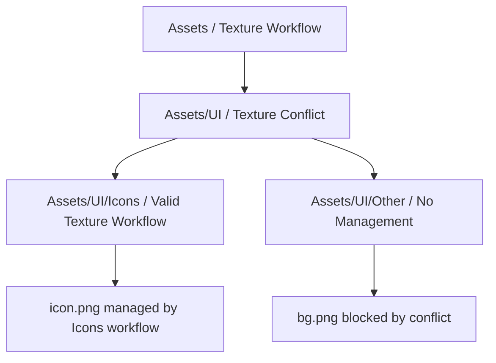

# AssetFlow 资源工作流设计

<div style="border:1px solid #d0d7de;border-radius:8px;padding:16px;margin:12px 0;background:#f6f8fa;">
  <strong>产品定位</strong>
  <p style="margin:8px 0 0;">
    AssetFlow 是一个 Unity 资源工作流工具。它允许团队在文件夹维度定义资源处理流程，包括 importer 设置、
    导入前处理、导入后处理、资源校验、作用范围、处理状态和错误反馈。
  </p>
</div>

## 1. 目标

AssetFlow 的目标不是替换 Unity 原生导入管线，而是在 Unity 的资源导入流程之上增加一层可管理、可解释、可复用的文件夹级工作流。

核心目标：

1. 让同一文件夹下的同类资源遵循一致的导入与处理规则。
2. 新增或修改资源时自动执行对应工作流。
3. 配置变更时通过显式 `Apply` 重新处理受管资源。
4. 在资源 Inspector 中明确显示资源是否被 AssetFlow 接管，以及由哪个配置接管。
5. 支持用户扩展导入前处理器、导入后处理器和校验器。
6. 避免因为资源依赖、文件写入或重复 reimport 导致 Unity 卡死。

<div style="border:1px solid #1f883d;border-radius:8px;padding:14px;margin:16px 0;background:#dafbe1;">
  <strong>MVP 范围</strong>
  <p style="margin:8px 0 0;">
    第一阶段只实现基于 Unity <code>AssetImporter</code> 类型的工作流，例如 <code>TextureImporter</code>、
    <code>ModelImporter</code>、<code>AudioImporter</code>。基于文件后缀的自定义类型暂不实现，只保留未来扩展空间。
  </p>
</div>

## 2. 非目标

MVP 暂不处理以下内容：

1. 不实现后缀版本工作流，例如 `.json`、`.csv`、`.bytes` 的自定义文件类型。
2. 不把资源切换到另一个 `ScriptedImporter`。
3. 不把接管状态写入资源 `.meta`。
4. 不做配置删除后的 importer 原始设置恢复。
5. 不实现智能增量阶段执行。`Apply` 固定为完整重导入。
6. 不实现 validator 自动修复。validator 默认只报告问题。

## 3. 核心术语

| 术语 | 含义 |
|---|---|
| AssetFlow | 文件夹级资源工作流系统 |
| Workflow | 一个 AssetFlow 配置所定义的完整资源处理流程 |
| AssetFlowConfig | 放在文件夹中的工作流配置资源 |
| Importer Workflow | 基于 Unity `AssetImporter` 类型的工作流 |
| TypeKey | 工作流类型标识，MVP 中为 importer 类型全名 |
| Managed Asset | 被某个 AssetFlowConfig 接管的资源 |
| PreImportProcessor | 导入前处理器，处理对象是 importer |
| PostImportProcessor | 导入后处理器，处理对象是导入出的资源 |
| Validator | 校验器，处理对象是导入出的资源 |
| Preset | Unity `Preset`，用于保存 importer 设置；在 AssetFlow 中由内置 `PreImportProcessor` 持有并应用 |
| AssetFlowIndex | AssetFlow 的本地缓存索引，保存在 `Library/AssetFlow/Index.json` |
| RuleHash | 配置当前规则内容的 hash |

## 4. 配置文件形态

### 4.1 创建方式

AssetFlow 配置通过文件夹右键菜单创建：

```text
Create > AssetFlow > Texture
Create > AssetFlow > Model
Create > AssetFlow > Audio
```

创建时使用推荐文件名：

```text
AssetFlow.Texture.asset
AssetFlow.Model.asset
AssetFlow.Audio.asset
```

真实身份不依赖文件名，而依赖配置资源类型与 `TypeKey`。即使用户重命名配置文件，AssetFlow 仍应能扫描并识别。

### 4.2 配置扫描

扫描配置时使用类型扫描，而不是只依赖文件名：

```csharp
AssetDatabase.FindAssets("t:AssetFlowConfig")
```

文件名仅作为创建时的约定和 Inspector 中的推荐提示。

### 4.3 配置结构

MVP 使用 importer 版本配置：

```csharp
public abstract class AssetFlowConfig : ScriptableObject
{
    public abstract string TypeKey { get; }
    public bool includeSubfolders;
}

public abstract class AssetFlowImporterConfig<TImporter> : AssetFlowConfig
    where TImporter : AssetImporter
{
    public sealed override string TypeKey => typeof(TImporter).FullName;

    [SerializeField] private List<AssetFlowPreImportProcessor> preImportProcessors;
    [SerializeField] private List<AssetFlowPostImportProcessor> postImportProcessors;
    [SerializeField] private List<AssetFlowValidator> validators;
}
```

<div style="display:flex;gap:8px;flex-wrap:wrap;margin:12px 0;">
  <span style="border:1px solid #0969da;border-radius:999px;padding:3px 10px;background:#ddf4ff;">Config</span>
  <span style="border:1px solid #1f883d;border-radius:999px;padding:3px 10px;background:#dafbe1;">PreImport</span>
  <span style="border:1px solid #9a6700;border-radius:999px;padding:3px 10px;background:#fff8c5;">PostImport</span>
  <span style="border:1px solid #cf222e;border-radius:999px;padding:3px 10px;background:#ffebe9;">Validator</span>
</div>

## 5. Importer 设置

### 5.1 Preset 是一种内置 PreImportProcessor

Importer 设置使用 Unity `Preset` 表达，不直接引用某个资源的 `AssetImporter` 实例。

在 AssetFlow 中，`Preset` 不是独立阶段，也不是 `AssetFlowImporterConfig` 上的单独字段。它由一个内置的导入前处理器持有和应用：

```text
ApplyPresetPreImportProcessor<TImporter>
```

因此执行模型统一为：

```text
PreImportProcessors 按列表顺序执行
```

其中 `ApplyPresetPreImportProcessor` 只是列表中的一个特殊内置处理器。

原因：

1. `AssetImporter` 绑定具体资源和 `.meta`，不是稳定模板资产。
2. 模板源资源被移动或删除会导致引用语义混乱。
3. `Preset` 更适合作为可序列化、可 diff、可版本化的 importer 设置载体。
4. 把 `Preset` 作为内置 `PreImportProcessor` 可以避免“独立 Preset 阶段 + PreImportProcessor 列表”的双入口模型。

### 5.2 ApplyPresetPreImportProcessor

内置处理器形态：

```csharp
public sealed class ApplyPresetPreImportProcessor<TImporter>
    : AssetFlowPreImportProcessor<TImporter>
    where TImporter : AssetImporter
{
    [SerializeField] private Preset preset;

    public override void Process(
        TImporter importer,
        AssetFlowPreImportContext context)
    {
        if (preset == null)
            return;

        if (!preset.CanBeAppliedTo(importer))
        {
            context.ReportError("Preset cannot be applied to importer.");
            return;
        }

        preset.ApplyTo(importer);
    }
}
```

规则：

1. 一个配置中最多存在一个 `ApplyPresetPreImportProcessor`。
2. 新建 importer 版本配置时默认带一个 `ApplyPresetPreImportProcessor`。
3. 默认顺序放在 `PreImportProcessors` 列表第一位。
4. 用户可以调整它在导入前处理器列表中的顺序。
5. 用户可以删除它；删除后表示该 workflow 不通过 `Preset` 设置 importer，只运行其他导入前处理器。
6. Inspector 可以把它特殊展示为 `Importer Preset`，但底层仍是处理器。

### 5.3 Preset 保存方式

`Preset` 作为 `ApplyPresetPreImportProcessor` 的子资源或其持有的子资源保存，并随 AssetFlow 配置一起存放：

```text
Assets/UI/AssetFlow.Texture.asset
  sub-asset: ApplyPresetPreImportProcessor
  sub-asset: TextureImporterPreset
```

配置 Inspector 提供操作：

```text
[Capture From Selected Asset]
[Edit Preset]
[Clear Preset]
```

`Capture From Selected Asset` 的语义：

1. 用户选择一个资源作为样本。
2. AssetFlow 获取该资源的 importer。
3. 找到或创建内置 `ApplyPresetPreImportProcessor`。
4. 用该 importer 创建或更新处理器持有的子资源 `Preset`。
5. 后续受管资源在执行该处理器时应用 importer 设置。

## 6. 类型系统

MVP 只支持 importer 版本：

```text
TextureImporter -> Texture Workflow
ModelImporter   -> Model Workflow
AudioImporter   -> Audio Workflow
```

匹配规则由框架固定，用户不能直接重写 `Matches`。

```csharp
bool Matches(AssetFlowConfig config, AssetImporter importer)
{
    return config.TypeKey == importer.GetType().FullName;
}
```

`DefaultImporter` 暂不作为普通 importer 类型开放。未来的后缀版本工作流可以用于处理 `.json`、`.txt`、`.csv`、`.bytes` 等文件。

<div style="border:1px solid #bf8700;border-radius:8px;padding:14px;margin:16px 0;background:#fff8c5;">
  <strong>设计约束</strong>
  <p style="margin:8px 0 0;">
    不允许用户直接重写匹配逻辑，是为了让 AssetFlow 能可靠计算作用范围、冲突关系、配置删除后的影响资源，以及 Apply 时的受管资源集合。
  </p>
</div>

## 7. 作用范围

### 7.1 默认范围

`includeSubfolders` 默认值为 `false`。

```text
includeSubfolders = false
只管理配置所在文件夹中的直属同类型资源。
```

```text
includeSubfolders = true
递归管理子文件夹中的同类型资源。
```

### 7.2 子配置边界

当父配置启用 `includeSubfolders` 时，子文件夹中的同类型配置会成为边界。父配置不会穿透子配置所在文件夹。

```text
Assets/
  AssetFlow.Texture.asset        includeSubfolders = true
  UI/
    AssetFlow.Texture.asset
    icon.png
```

结果：

```text
Assets 下其他 TextureImporter 资源 -> 父配置接管
Assets/UI/icon.png              -> UI 配置接管
```

### 7.3 冲突边界

同一文件夹下不能存在多个同 `TypeKey` 配置。

```text
Assets/UI/
  AssetFlow.Texture.asset
  MyTextureWorkflow.asset
```

如果两个配置试图定义同一 folder/type 的工作流，则该 folder/type 进入冲突状态。

冲突规则：

1. 冲突配置完全失效。
2. 不执行内置 `ApplyPresetPreImportProcessor`，因此不会应用 `Preset`。
3. 不执行 `PreImportProcessor`。
4. 不执行 `PostImportProcessor`。
5. 不执行 `Validator`。
6. 父级同类型配置不会穿透该冲突文件夹。
7. 冲突文件夹下更深层的合法同类型配置可以重新接管。



## 8. 三阶段工作流

AssetFlow 的 importer 版本工作流包含三个阶段：

```text
导入前处理 -> 导入后处理 -> 校验
```

完整执行顺序：

```text
PreImportProcessors
→ Unity Import
→ PostImportProcessors
→ Validators
```


### 8.1 PreImportProcessor

导入前处理器运行在 `OnPreprocessAsset` 阶段，处理对象是具体 importer。

```csharp
public abstract class AssetFlowPreImportProcessor<TImporter> : AssetFlowPreImportProcessor
    where TImporter : AssetImporter
{
    public virtual int Version => 1;

    public abstract void Process(
        TImporter importer,
        AssetFlowPreImportContext context);
}
```

职责：

1. 修改 importer 设置。
2. 根据路径、配置或项目规范修正 importer 参数。
3. 报告 warning 或 error。

约定：

1. `PreImportProcessor` 按配置列表顺序执行。
2. `ApplyPresetPreImportProcessor` 是一种内置 `PreImportProcessor`，默认位于列表第一位。
3. 其他 `PreImportProcessor` 可以覆盖 `ApplyPresetPreImportProcessor` 应用的设置。
4. 用户可以调整 `ApplyPresetPreImportProcessor` 的顺序，也可以删除它。
5. 不建议在导入回调中直接写当前源文件。

### 8.2 PostImportProcessor

导入后处理器运行在资源导入完成之后，处理对象是导入出的资源对象。

```csharp
public abstract class AssetFlowPostImportProcessor<TAsset> : AssetFlowPostImportProcessor
    where TAsset : UnityEngine.Object
{
    public virtual int Version => 1;

    public abstract void Process(
        TAsset asset,
        AssetFlowPostImportContext context);
}
```

执行对象来自：

```csharp
AssetDatabase.LoadAllAssetsAtPath(assetPath)
```

AssetFlow 按 `TAsset` 过滤匹配对象。这样同一个 Model 资源中的 `GameObject`、`AnimationClip`、`Material` 等 sub asset 都可以被对应处理器处理。

MVP 暂时允许 `PostImportProcessor` 完全修改资源或其他资源，但必须配套死循环检测。

### 8.3 Validator

校验器运行在 `PostImportProcessor` 之后，处理对象同样来自 `LoadAllAssetsAtPath`。

```csharp
public abstract class AssetFlowValidator<TAsset> : AssetFlowValidator
    where TAsset : UnityEngine.Object
{
    public virtual int Version => 1;

    public abstract IEnumerable<AssetFlowIssue> Validate(
        TAsset asset,
        AssetFlowValidationContext context);
}
```

约定：

1. Validator 默认只读。
2. Validator 返回 issue，不直接修改资源。
3. 自动修复能力留到后续阶段。

### 8.4 异常处理

如果某个 handler 执行失败，包括内置 `ApplyPresetPreImportProcessor`：

1. 捕获异常。
2. 记录 error。
3. 当前 handler 停止。
4. 后续 handler 继续执行。
5. 资源状态标记为 `Processed with errors`。

## 9. Apply 语义

配置变更后不自动批量处理旧资源，而是显式点击：

```text
Apply To Managed Assets
```

`Apply` 的语义：

1. 计算当前配置实际接管的资源集合。
2. 对这些资源执行完整重导入。
3. 完整执行 `PreImport -> Unity Import -> PostImport -> Validator`。
4. 更新 `AssetFlowIndex` 中的处理状态和 `lastProcessedRuleHash`。

<div style="border:1px solid #0969da;border-radius:8px;padding:14px;margin:16px 0;background:#ddf4ff;">
  <strong>Apply 范围</strong>
  <p style="margin:8px 0 0;">
    只有一个 Apply 按钮。它作用于当前配置按作用范围规则实际接管的资源集合；
    不穿透同类型子配置，也不穿透冲突边界。
  </p>
</div>

### 9.1 配置未 Apply 时的行为

如果用户修改配置但没有点击 `Apply`：

1. 旧资源不会自动批量重处理。
2. 新增或被用户修改的资源仍会自动导入，并使用当前配置内容。
3. AssetFlow 需要提示配置存在未 Apply 变化。

提示方式：

1. 配置 Inspector 显示 out-of-date 数量。
2. 资源自动导入时输出 warning。
3. 资源 Inspector 显示当前资源是否使用了最新 `RuleHash`。

### 9.2 离开配置时的未应用提示

当用户正在编辑 `AssetFlowConfig`，且当前配置存在未应用变更时，如果用户尝试离开该配置资源，应弹出确认提示。

触发场景：

1. 在 Inspector 中选择其他资源。
2. 关闭 AssetFlow 配置 Inspector 或相关编辑窗口。
3. 切换到另一个 AssetFlow 配置。
4. 删除、移动或重命名当前配置前。

提示选项：

```text
This AssetFlow workflow has unapplied changes.

[Apply] [Discard] [Cancel]
```

行为：

| 操作 | 结果 |
|---|---|
| Apply | 保存当前配置内容，并对当前配置实际接管的资源执行完整 `Apply To Managed Assets` |
| Discard | 放弃当前未应用修改，恢复到上一次 applied 状态，然后允许离开 |
| Cancel | 取消离开操作，继续停留在当前配置 |

<div style="border:1px solid #bf8700;border-radius:8px;padding:14px;margin:16px 0;background:#fff8c5;">
  <strong>实现注意</strong>
  <p style="margin:8px 0 0;">
    为了支持 <code>Discard</code>，AssetFlow 需要保存一份上一次 applied 状态的快照。
    这份快照可以保存在 <code>Library/AssetFlow/Index.json</code> 或单独缓存中，不应写入资源 <code>.meta</code>。
  </p>
</div>

这意味着配置有两个概念：

```text
editing state：当前 Inspector 中正在编辑的配置内容
applied state：上一次成功 Apply 后的配置内容快照
```

导入时资源仍使用当前配置内容；未应用提示用于避免用户无意离开配置后忘记批量同步旧资源。

### 9.3 Out-of-date 判断

判断规则：

```text
managed && assetRecord.lastProcessedRuleHash != config.currentRuleHash
```

从未处理过的受管资源也视为 out-of-date。

冲突资源和未接管资源不参与 out-of-date 判断。

## 10. 配置版本与 RuleHash

`RuleHash` 用于描述当前工作流规则版本。

应纳入 `RuleHash` 的内容：

1. 配置资源的序列化内容。
2. `includeSubfolders`。
3. `PreImportProcessor` 类型、`Version` 和序列化设置。
4. 内置 `ApplyPresetPreImportProcessor` 持有的 importer `Preset` 内容。
5. `PostImportProcessor` 类型、`Version` 和序列化设置。
6. `Validator` 类型、`Version` 和序列化设置。

`Version` 的作用是表达代码逻辑变化。即使配置资源内容没有变化，只要某个 handler 的处理逻辑升级，就应该递增 `Version`，从而让 `RuleHash` 变化。

```csharp
public class ForceSpriteModeProcessor : AssetFlowPreImportProcessor<TextureImporter>
{
    public override int Version => 2;

    public override void Process(TextureImporter importer, AssetFlowPreImportContext context)
    {
        importer.textureType = TextureImporterType.Sprite;
    }
}
```

## 11. Unity 依赖机制

AssetFlow 可以使用 Unity custom dependency 表达已接管资源对配置版本的依赖。

```csharp
AssetDatabase.RegisterCustomDependency(
    $"com.company.assetflow/{configGuid}",
    ruleHash);
```

资源导入时声明依赖：

```csharp
context.DependsOnCustomDependency(
    $"com.company.assetflow/{configGuid}");
```

但 custom dependency 不能覆盖所有场景，因此不能只依赖它。

custom dependency 适合处理：

1. 已接管资源对应配置内容变化。
2. 内置 `ApplyPresetPreImportProcessor` 持有的 `Preset` 变化。
3. handler 参数变化。
4. handler `Version` 变化。

仍需要 `AssetFlowIndex` 处理：

1. 新增配置。
2. 删除配置。
3. 移动配置。
4. `includeSubfolders` 改变。
5. 子文件夹同类型配置新增或删除。
6. 冲突关系变化。

## 12. AssetFlowIndex

### 12.1 保存位置

AssetFlowIndex 保存为本地缓存：

```text
Library/AssetFlow/Index.json
```

不保存到 `Assets/`，也不写入 `.meta`。

原因：

1. Index 是编辑器缓存，不是项目源数据。
2. 可以从项目资源重新扫描重建。
3. 放入 `Assets/` 会参与 Unity 导入，容易产生额外刷新。
4. 写入 `.meta` 会污染代码仓库并造成大量无意义变更。

### 12.2 数据结构

```csharp
public sealed class AssetFlowIndexData
{
    public int schemaVersion;
    public List<AssetFlowConfigRecord> configs;
    public List<AssetFlowAssetRecord> assets;
    public List<AssetFlowValidationRecord> validationResults;
}
```

```csharp
public sealed class AssetFlowConfigRecord
{
    public string configGuid;
    public string configPath;
    public string folderPath;
    public string typeKey;
    public bool includeSubfolders;
    public string ruleHash;
}
```

```csharp
public sealed class AssetFlowAssetRecord
{
    public string assetGuid;
    public string assetPath;
    public string importerTypeKey;
    public string managedByConfigGuid;
    public string managedByConfigPath;
    public string lastProcessedRuleHash;
    public long lastProcessedTicks;
}
```

主键使用 GUID。路径只是缓存，应随时从 GUID 校正。

### 12.3 Index 用途

AssetFlowIndex 用于：

1. 显示资源接管状态。
2. 显示资源最近一次处理结果。
3. 判断 out-of-date。
4. 在配置删除后找到旧配置曾经接管过的资源。
5. 在配置移动或范围变化后计算受影响资源。
6. 保存最近校验结果。

## 13. Inspector 显示

资源 Inspector 顶部需要显示 AssetFlow 状态。

状态示例：

<div style="border:1px solid #1f883d;border-radius:8px;padding:12px;margin:12px 0;background:#dafbe1;">
  <strong>AssetFlow Managed</strong>
  <p style="margin:6px 0 0;">Config: Assets/UI/AssetFlow.Texture.asset</p>
  <p style="margin:4px 0 0;">Status: Up to date</p>
</div>

<div style="border:1px solid #bf8700;border-radius:8px;padding:12px;margin:12px 0;background:#fff8c5;">
  <strong>AssetFlow Out of Date</strong>
  <p style="margin:6px 0 0;">This asset was processed with an older RuleHash.</p>
</div>

<div style="border:1px solid #cf222e;border-radius:8px;padding:12px;margin:12px 0;background:#ffebe9;">
  <strong>AssetFlow Conflict</strong>
  <p style="margin:6px 0 0;">Multiple configs of the same TypeKey exist in this folder. No workflow is applied.</p>
</div>

需要显示的信息：

1. 是否被 AssetFlow 接管。
2. 接管它的配置路径。
3. 当前 `RuleHash`。
4. 最近处理的 `RuleHash`。
5. 是否 out-of-date。
6. 是否存在冲突。
7. 是否有暂停的 handler。
8. 最近校验结果。

## 14. 文件变化时的自动处理

普通资源变化时自动进入 AssetFlow。

触发场景：

1. 新增资源。
2. 修改资源。
3. 移动资源。
4. 手动 reimport。
5. `Apply To Managed Assets` 触发的批量 reimport。

处理流程：

```text
Unity detects asset change
→ AssetFlow resolves config
→ If conflict: report conflict and stop
→ If managed: run workflow
→ Update Index
```

配置变化时不自动批量处理旧资源，只更新状态并提示用户 `Apply`。

## 15. 配置删除与脱管

配置删除后：

1. 不恢复接管前的 importer 原始设置。
2. 如果存在父级同类型配置且范围覆盖该资源，则资源可在后续处理时由父配置接管。
3. 如果不存在新配置，则资源脱管。
4. 脱管只表示 AssetFlow 不再管理它，资源当前 importer 设置保持最后状态。
5. Index 通过旧 `ConfigRecord` 与 `AssetRecord` 识别受影响资源。

## 16. 死循环检测

AssetFlow 允许 `PostImportProcessor` 修改资源，因此必须有死循环检测。

### 16.1 LoopKey

死循环检测 key：

```text
assetGuid + configGuid + stage + handlerTypeFullName
```

### 16.2 计数方式

两种计数来源：

1. AssetFlow 主动队列：按 `chainId` 计数。
2. Unity 或用户自然触发：按 rolling time window 计数。

阈值建议：

```text
同一 LoopKey 在同一 chain 或时间窗口内超过 3 次，判定为可能死循环。
```

### 16.3 处理方式

检测到死循环后：

1. 只暂停触发循环的那个 handler。
2. 同一资源的其他 handler 继续执行。
3. 报错并显示具体资源、配置、阶段和 handler。
4. 暂停状态 MVP 先保存在 `SessionState`。
5. Inspector 提供 `Retry`，用于清除暂停并重新导入该资源。

错误示例：

```text
AssetFlow import loop detected. Handler has been paused for this asset in this editor session.

Asset: Assets/UI/icon.png
Config: Assets/UI/AssetFlow.Texture.asset
Stage: PostImport
Handler: GenerateSpriteAtlasData
Threshold: 3 executions in one import chain
```

## 17. 冲突处理

### 17.1 冲突条件

MVP 中冲突条件很简单：

```text
same folder + same TypeKey + multiple AssetFlowConfig
```

### 17.2 冲突结果

冲突后：

1. 冲突配置完全不生效。
2. 冲突文件夹仍作为父配置边界。
3. 冲突范围内资源不被父配置接管。
4. 更深层合法配置可以接管。
5. Inspector 显示 conflict。
6. Console 输出错误并列出冲突配置路径。

## 18. 推荐实现模块

```text
AssetFlowConfig
AssetFlowImporterConfig<TImporter>
AssetFlowPreImportProcessor<TImporter>
AssetFlowPostImportProcessor<TAsset>
AssetFlowValidator<TAsset>
AssetFlowResolver
AssetFlowIndex
AssetFlowApplyQueue
AssetFlowLoopGuard
AssetFlowInspectorOverlay
AssetFlowConfigEditor
AssetFlowPresetUtility
```

模块职责：

| 模块 | 职责 |
|---|---|
| AssetFlowResolver | 根据路径和 importer 类型解析接管配置 |
| AssetFlowIndex | 保存配置记录、资源记录、校验结果 |
| AssetFlowApplyQueue | 执行显式 Apply 和批量重导入 |
| AssetFlowLoopGuard | 检测并暂停可能死循环的 handler |
| AssetFlowInspectorOverlay | 在资源 Inspector 显示接管状态 |
| AssetFlowConfigEditor | 编辑配置、显示 out-of-date、提供 Apply 按钮 |
| AssetFlowPresetUtility | 捕获和更新 `ApplyPresetPreImportProcessor` 持有的 importer Preset |

## 19. MVP 产品形态总结

MVP 最终形态：

1. AssetFlow 是文件夹级资源工作流工具。
2. 第一阶段只做 importer 版本工作流。
3. 每个配置只对应一种 importer 类型。
4. 配置通过文件夹右键创建。
5. 配置默认只管理当前文件夹，不递归。
6. importer 设置使用 Unity `Preset`，但通过内置 `ApplyPresetPreImportProcessor` 应用，并作为配置相关子资源保存。
7. 工作流分为导入前处理、导入后处理、校验三个阶段。
8. 导入后处理和校验通过 `LoadAllAssetsAtPath` 获取 main asset 与 sub assets，并按 `TAsset` 类型过滤。
9. 配置变更后通过显式 `Apply To Managed Assets` 完整重导入受管资源。
10. 接管状态和处理结果保存在 `Library/AssetFlow/Index.json`，不写 `.meta`。
11. 同 folder/type 多配置冲突时，冲突配置完全失效，但仍阻断父配置。
12. 死循环检测只暂停触发循环的 handler，不暂停整个资源工作流。

## 20. 后续扩展方向

后续可以在不破坏 MVP 架构的前提下扩展：

1. 后缀版本工作流，例如 `.json`、`.csv`、`.bytes`。
2. 自定义 matcher，但需要保持影响范围可计算。
3. Validator 自动修复。
4. 只执行 validator 的 `Revalidate`。
5. 根据变更类型智能执行部分阶段。
6. Addressables 相关处理器。
7. 配置影响范围预览窗口。
8. 持久化 loop pause 记录。
9. 配置导入导出和跨文件夹复用。
